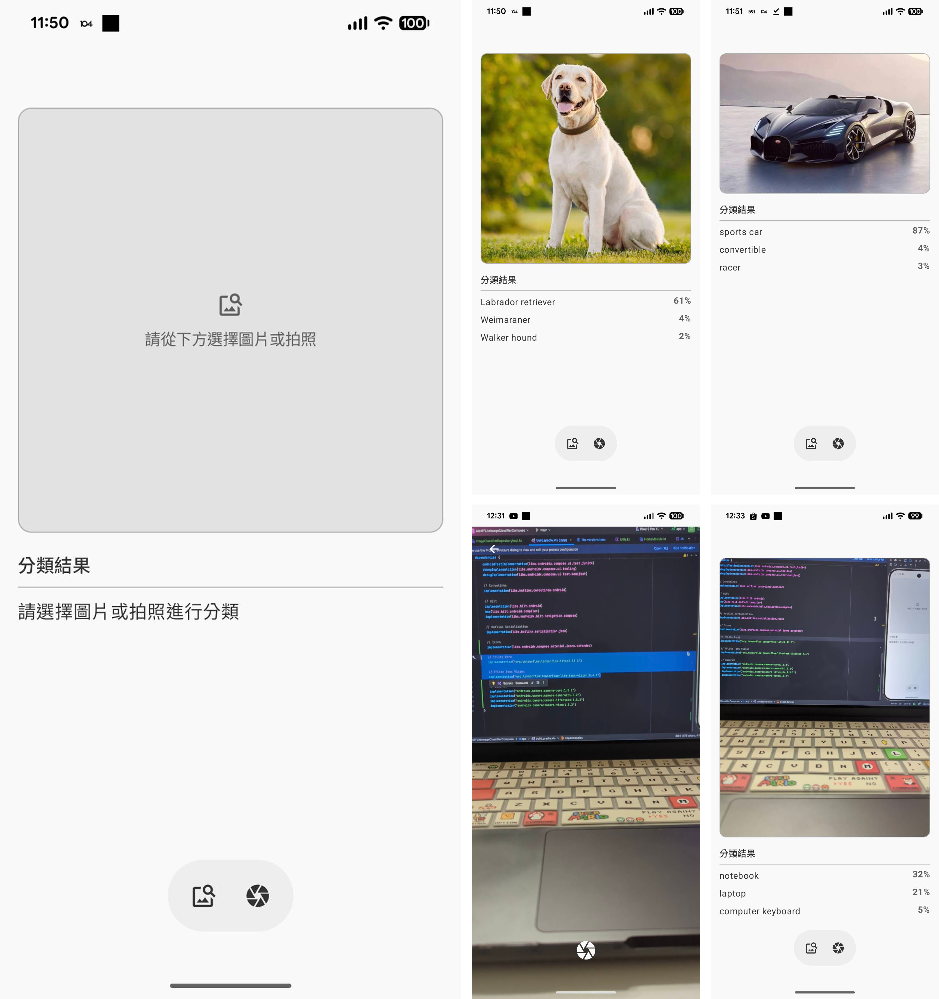

# **Alex TensorFlow Lite Image Classification Compose（On-Device）**

### Kotlin • Jetpack Compose • Hilt • Clean Architecture • CameraX • TensorFlow Lite Tasks

本專案是一個 **Android On-Device AI Demo**，展示如何在 Android 裝置上執行 TensorFlow Lite（TFLite）模型，實作「即時影像分類」功能。
整體架構基於 **Clean Architecture** 設計，並整合：

* TFLite Task Library – 高階模型推論 API
* CameraX – 拍照與即時影像取得
* Compose – 現代化 UI 與圖片預覽
* Hilt – DI 管理、清晰分層
* Bitmap Pipeline – EXIF 修正、ARGB_8888 轉換、最大邊縮圖

---

## 📸 Demo

|                       |
|-----------------------|
|  |

---

# 📱 **功能特色**

### ✔ 1. On-Device AI 推論（完全離線）

使用 TFLite EfficientNet-Lite 模型進行影像分類，不依賴網路、低延遲、快速回應。

### ✔ 2. CameraX 即拍即分類

支援後鏡頭拍照、EXIF 方向修正、Bitmap 最佳化。

### ✔ 3. Gallery 選圖分類

從相簿選擇任意照片立即推論。

### ✔ 4. 專業 Bitmap 處理流程

* EXIF 方向自動旋轉
* 轉換成 TFLite 要求的 ARGB_8888
* 按最大邊 1080px 等比縮圖，兼具效能與品質

### ✔ 5. Clean Architecture 分層

* `presentation`: HomeScreen / HomeViewModel
* `domain`: UseCase
* `data`: Repository + TFLite 推論實作
* `core`: Bitmap / Utils 工具類

### ✔ 6. Material3 + Compose UI

* 圖片預覽（保留原始比例）
* 分類結果列表
* HorizontalFloatingToolbar（Camera / Gallery）

---

# 🏗 **專案架構（Clean Architecture）**

```
app/
├── core/
│   ├── BitmapExt.kt          # Bitmap rotateByExif, ensureArgb8888, scaleDown, Uri.toBitmap
│   └── Utils.kt              # 其他工具函式
│
├── features/
│   ├── home/
│   │   ├── HomeScreen.kt     # Compose UI 層
│   │   ├── HomeViewModel.kt  # UI 狀態管理 + 推論觸發
│   │   ├── HomeModule.kt     # Hilt DI bindings
│   │   ├── CameraCapture.kt  # CameraX 拍照 + EXIF 修正
│   │   └── ClassifyImageUseCase.kt
│   │
│   └── data/
│       ├── ImageClassifierRepository.kt
│       └── ImageClassifierRepositoryImpl.kt # TFLite Task Library 推論
│
└── MainActivity.kt
```

---

# 🤖 **AI 推論流程（專業級 Pipeline）**

## 1️⃣ 圖片來源

使用者可以從：

* CameraX 拍照
* Gallery 選擇圖片

## 2️⃣ Bitmap 前處理

所有 Bitmap 都經過統一處理：

```
Uri/File → BitmapFactory.decodeFile()
         → rotateByExif()      # 修正方向
         → ensureArgb8888()    # 確保 TFLite 可接受
         → scaleDown(1080)     # 控制大小提升效能
```

此流程可高度降低 OOM 風險並加速推論。

## 3️⃣ TFLite 模型推論

使用 **TensorFlow Lite Task Library – ImageClassifier**：

* 自動處理 resize / normalization
* 回傳 top-k label + score
* 支援多執行緒、NNAPI、GPU delegate（可擴充）

```kotlin
val classifier = ImageClassifier.createFromFileAndOptions(...)
val tensor = TensorImage.fromBitmap(bitmap)
val results = classifier.classify(tensor)
```

## 4️⃣ Domain UseCase

`ClassifyImageUseCase` 將推論封裝成獨立責任，可安全於 ViewModel 呼叫。

## 5️⃣ UI 狀態更新

HomeViewModel 更新：

* selectedBitmap
* labels
* isLoading
* error

---

# 🎨 **UI 設計（Jetpack Compose + M3）**

### 📷 圖片預覽

* 自動依原始比例顯示
* 有 placeholder fallback
* 自動裁切圓角 + 邊框

### 🧪 推論結果列表

* LazyColumn
* Label + Score 顯示
* Loading 狀態處理

### 🛠 Floating Toolbar

* Camera
* Gallery
* 自動避開 Navigation Bar（`navigationBarsPadding()`）

---

# 🔌 **DI（Hilt）設計**

```kotlin
@Module
@InstallIn(SingletonComponent::class)
abstract class HomeModule {
    @Binds
    abstract fun bindRepository(
        impl: ImageClassifierRepositoryImpl
    ): ImageClassifierRepository
}
```

Repository 可被未來切換：

* TFLite
* ONNX Runtime
* MediaPipe
* Remote 推論

---

# 📦 **模型**

建議模型來源：TensorFlow Hub

範例（EfficientNet-Lite0 float32 版）：
[https://www.kaggle.com/models/tensorflow/efficientnet/lite0-fp32](https://www.kaggle.com/models/tensorflow/efficientnet/lite0-fp32)

> 放置於
> `app/src/main/assets/efficientnet_lite0.tflite`

---

# 🚀 **未來可擴充方向**

| 功能               | 說明                                     |
| ---------------- | -------------------------------------- |
| ONNX Runtime     | 支援 PyTorch / 多框架模型                     |
| Object Detection | YOLO / MobileDet / MediaPipe Detection |
| Segmentation     | Deeplab / MobileSeg                    |
| History Log      | 使用 Room 儲存推論紀錄                         |
| GPU Delegate     | 進一步提升 TFLite 推論速度                      |
| Benchmark        | 統計推論時間、記憶體使用、FPS                       |

---
## 👤 Author

**Alex Yang**  
Android Engineer
🌐 [github.com/m9939418](https://github.com/m9939418)
